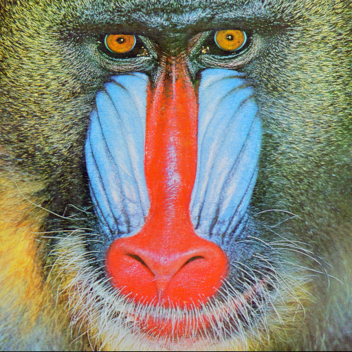
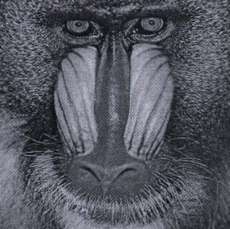
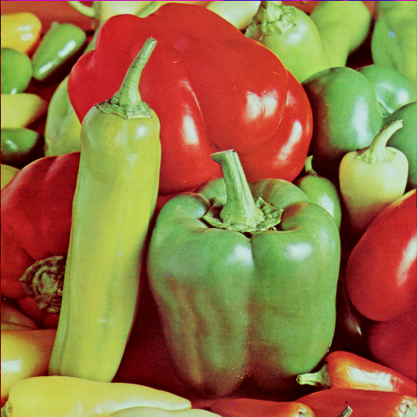
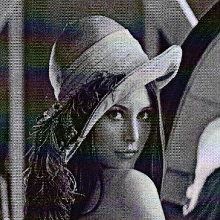
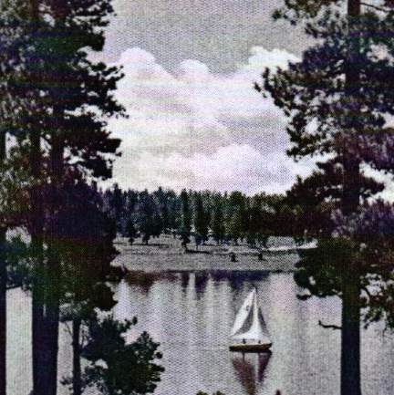

# PIHMATCH

**Perceptual Image Hashing Matching Challenge** is a benchmarking framework to test Perceptual Image Hashing Algorithms that should be used for content identification. It allows researchers to create standardized challenges against which they can run their perceptual image hashing algorithms in different configurations.

## Basic Idea

The underlying idea of PIHMATCH is this: You as a scientist create a standardized set of challenges. These consist of a series of images and comparison images, whereby for each image-comparison image pair it is defined whether the perceptual image hashing algorithm must recognize these images as identical or different. Challenges can be created, for example, by subjecting images to various manipulations (scaling, adding noise, etc.) or by randomly combining images from a larger pool of images. For a more detailed explanation, please refer to the Create challenges section.

| Original Image                       | Comparative Image                      | Equal? |
| ------------------------------------ | -------------------------------------- | ------ |
|  |  | True   |
|  |  | False  |
|  |  | True   |

Having a set of challenges you can run different test on them. A test if defined by a wrapper function around a perceptional image hashing algorithm performing the following steps:

1. load original and comparative images from path
2. for every original and comparative image pair calculate the hash of both images
3. decide if the algorithm considers the images to be equal for example based on a hamming distance and a threshold

Based on the correct decisions defined in the challenge an error-rate will be calculated for the test. Based on the error rates, the suitability of different configurations of the same perceptual image hashing algorithm or different perceptual image hashing algorithms can now be evaluated. Researchers can export the data as pandas dataframe, which provides maximum flexibility for further analysis.

## Requirements

Currently the framework was tested on `Linux` only.

In order to work with `sqlite3` please make sure your environment supports the python wrapper with all libraries needed.

## Installation

Clone the repository, change directory to the repository, create a new virtual environment (optional), run the installer script.

```bash
python3 setup.py install
```

Now you should be ready to use PIHMATCH.

## Create challenges

The first step for evaluating different perceptual image hashes is to define challenges. Challenges are sets of image pairs that should be detected as identical or different. To make it easy to create challenges PIHMATCH comes with a challenge creator script. If you would like to run the evaluation part on a server but create the challenges on your own pc make sure that you use relative paths to the images and copy the images in the same path to your server.

```batch
python3 challenge_creator.py
```

```batch
PIHMATCH - Challenge creator
==============================
 1 : Add challenge
 2 : Show challenges
 3 : Remove challenge

Enter the selection (["", q] to quit):
```

The script provides you with three basic options: adding, showing and deleting challenges. Showing and deleting challenges should be self-explanatory. Adding challenges supports three modes:

```batch
Add challenge
 1 : Add custom challenge
 2 : Add shuffled challenge
 3 : Add sensitivity challenge
 4 : Add attack challenge
```

### (1) Custom challenge

Custom challenges allow you to define you own original and comparative image datasets. You can use it whenever you want to know how your perceptional image hashing algorithms perform in a special filed of application. One example coud be to test how well your algorithm can match original images with a printed version of it. The structure of a challenge is the following:

```
sName (str): the name of the challenge.
aOriginalImages (list of strings): List of paths of the original images
aComparativeImages (list of strings): List of paths of the images that should be compared to
                                      the original image at the same position in the list
aTargetDecisions (list of boolean): List of boolean defining whether the images linked in aOriginalImages
                                    and aComparativeImages beeing at the same position in the list are
                                    the same (True) or not (False)
dicMetadata (obj): an object defining metadata for the challenge like what printer was used or what kind of attack
                    using which parameters was performed
```

**Here is an example of a custom challenge**:

_sName_: print_scan_3

| _aOriginalImages_                    | _aComparativeImages_                   | _aTargetDecisions_ |
| ------------------------------------ | -------------------------------------- | ------------------ |
|  |  | True               |
|  |  | False              |
|  |  | True               |

_dicMetadata_: `{"printer": "Epson XYZ", "resolution": "250dip"}`

The challenge creator helps you to define custom challenges.

```bash
Add challenge
 1 : Add custom challenge
 2 : Add shuffled challenge
 3 : Add sensitivity challenge
 4 : Add attack challenge

Enter the selection ([""] to return, q to quit): 1

Specify a name of the challenge:
Challenge name: print_scan_3

Specify a path to the original images.
Original Images: exampledata/_img

Specify a path to the comparative images.
Comparative Images: exampledata/_img

Specify additional metadata in form of a python dictionary {"attribute": "value"}.
Attributes [default {}]: {"printer": "Epson XYZ", "resolution": "250dpi"}
```

In oder to match original images to their comparative images they have to fulfill the following naming convention:

```
<ext> = ".png" | ".bmp" | ".jpg" | ".jpeg" | ".tiff"
original image = <original_image_name>.<ext>
<comparative image> = <original_image_name>_{"_S" | "_D"}.<ext>
```

You can place originals and comparative images in the same folder. The naming convention ensures that the algorithm can assign them correctly.

The attributes enable you to provide information you can base your filtering or grouping later on while analyzing your data. In the example above we provided the information which printer was printing the images and in what resolution.

### (2) Shuffled Challenge

Shuffled challenges help you to calculate the sensitivity of your perceptional image hashing algorithm. The challenge maker takes a set of images and forms groups of original images an randomly chosen comparative images from the given pool of images. A specified ratio of them can be compared to itself as kind of control group. A ratio of 0 means that all images compared to randomly chosen other images of the set. A ratio of `0.2` means that 40\% of images get its own as comparative image and the target matching decision will be set to `True` The rest will be compared with randomly chosen pictures of the given picture dataset and the target matching decision will be set to `False`.

```bash
Add challenge
 1 : Add custom challenge
 2 : Add shuffled challenge
 3 : Add sensitivity challenge
 4 : Add attack challenge

Enter the selection ([""] to return, q to quit): 2
shuffled challenge

Specify a name of the challenge:
Challenge name: stanford_dogs_dataset

Specify a path to the original images.
Original Images: exampledata/imagesets/dogs
Specify the ratio of matching images [0, 1]:
ratio: 0.2
```

## (3) Sensitivity Challenge

Sensitivity challenges are the best way to measure the sensitivity of your perceptual image hashing algorithms. In this challenge method every image of an image set will be compared to a set of not matching images of the same image set. You can choose between selecting the number of compared images as absolute value or as percentage of the number of images. Use the first option if you have a huge amount of images in your image set and you want to compare each image to a representative randomly chosen subset only. Using the second option you can also compare every image in the set to every other image in the set. Be aware that the number of image to comparative-image comparisons increases by the number of images in the set `n` by `n * n-1`.

```bash
Add challenge
 1 : Add custom challenge
 2 : Add shuffled challenge
 3 : Add sensitivity challenge
 4 : Add attack challenge

Enter the selection ([""] to return, q to quit): 3

Challenge name: sensitivity1
Specify a path to the original images.
Original Images: exampledata/imagesets/dogs_subset
Nr. of images found: 12


Specify with how many not matching images of the image set each image will be compared.

Do you want to define the number of comparative images per image as absolute value or as percentage of the image set?
selection [a - absolute | p - percentage]: p

Number of images in imageset: 12

Specify with how many images (percent of the image set) each image should be compared with [0, 1]:
percent: 1

resulting nr. of compared images: 11
Added sensitivity challenge
```

## (4) Attack Challenge

The standard case for the perceptual image hashing algorithms to be good is the recognition of images as such even after they have been manipulated. In oder to test the robustness of different ways of manipulation the challenge creator has a set of attacks implemented that it can apply to pictures. You can attack a set of images with an attack of your choice. For the most attacks you can even set a range and increment of a parameter whereupon the challenge creator will attack all images in the set several times with varying parameters. Here is an example of the `JPEG-Quality` attack:

```bash
Add challenge
 1 : Add custom challenge
 2 : Add shuffled challenge
 3 : Add sensitivity challenge
 4 : Add attack challenge

Enter the selection ([""] to return, q to quit): 4

Add attack challenge
 1 : Rotation (cropped)
 2 : Rotation (fitted)
 3 : Crop (uniform)
 4 : Crop (nonuniform)
 5 : Overlay
 6 : JPEG Quality
 7 : Speckle Noise
 8 : Salt and Pepper Noise
 9 : Gauss Noise
10 : Scale (uniform)
11 : Scale (nonuniform)
12 : Contrast
13 : Gamma

Enter the selection ([""] to return, q to quit): 6

Specify a name of the challenge:
Challenge name: jpeg_quality_beyond_50

Specify a path to the original images.
Original Images: exampledata/imagesets/dogs
Specify a target path for the attacked images.
Target path: exampledata/imagesets/dogs_attacked_jpeg_beyond_50
path exampledata/imagesets/dogs_attacked_jpeg_beyond_50 is not existent
would you like to create it or quit [c/Q]: c
c
Specify the range for JPEG quality in percent [0, 100]:
min (<=): 0
max (<): 51
step : 10
```

The challenge creator will create an attacked image for every original image and for every value of the parameter. Have a look in the code if you are not sure how the attacks are implemented. You can find them in the file `pihmatch/attacks_presets.py`.

## Run tests

The tests of PIHMATCH are like a blind test for perceptual image hashing algorithms. A test gives a set of original and corresponding comparative images to a user defined algorithms using a perceptual image hash. This algorithms compares every single original and comparative image pair and decided whether tey are the same. With all decisions for all image pairs of a challenge returned to the PIHMATCH framework it can compare the decisions with the target decisions for the challenge and calculate the error rate. Based on the error rate you can compare your algorithm or different configurations of your algorithm with others.

Running tests and evaluating the performance of your perceptual image hashing algorithms can take a lot of time. Make sure you used relative paths while defining challenges in order to run the testing part on a server.

The PIHMATCH Framework offers the user a TestRunner component. Have a look at `example_tests.py` in order to get an idea how to use it. There you can see an example for `dHash`. First of all you have to write a wrapper function for your algorithm that handles to get a list of original and comparative images as first two arguments. You can set an arbitrary amount of additional named arguments. It has to hash every original and comparative image and decide whether they are the same or not based on a smart algorithm or a distance and a threshold. The wrapper function has to return a list of decisions having the same dimension like the list of original and comparative images. Additionally it can return a dictionary filled with arbitrary metainformation. This metainformation will be saved along with the results of the test.

```python
def test_dhash(aOriginalImages, aComparativeImages, lThreshold=0.15, lHashSize=16):
    from pihmatch.hashalgos_preset import dhash

    # create dictionary of metadata
    dicMetadata = {"algorithm": "dhash",
                   "hash_size": lHashSize, "threshold": lThreshold}

    # compare every image
    aDecisions = []
    for i, aOriginalImagePath in enumerate(aOriginalImages):
        aComparativeImagePath = aComparativeImages[i]

        # get images from path
        aOriginalImage = load_image(aOriginalImagePath)
        aComparativeImage = load_image(aComparativeImagePath)

        # calculate hashes
        aHashOriginal = dhash(aOriginalImage, hash_size=lHashSize)
        aHashComparative = dhash(aComparativeImage, hash_size=lHashSize)

        # calculate deviation
        dDeviation = hamming_distance(aHashComparative, aHashOriginal)

        # make decision
        bDecision = False
        if(dDeviation <= lThreshold):
            # images are considered to be the same
            bDecision = True

        # push decision to array of decisions
        aDecisions.append(bDecision)

    # return decision and dictionary of metadata
    return aDecisions, dicMetadata
```

Having this wrapper around `dHash` we now can test the performance of different configurations of the algorithm. First of all create a instance of the `TestRunner` and define the number of threads it should use:

```python
    oRunner = TestRunner(lNrOfThreads=NR_OF_THREADS)
```

Now we can create some useful values for the two variable arguments and add single test for all of them to the `TestRunner` instance. The first parameter of `run_test_async` is the name of the challenge. The second is a pointer to the wrapper function defined before and the last is a dictionary define all further named arguments for the wrapper function.

```python
 # iterate over thresholds
    for lThreshold in np.arange(0.05, 0.5, 0.05):
        # iterate over hash sizes
        for lHashSize in [8, 16, 32]:
            # add test to testrunner
            oRunner.run_test_async("printscan_printer1", test_dhash, {
                                   "lThreshold": lThreshold, "lHashSize": lHashSize})
```

The test will be executed as fast as a CPU is available to execute the thread. To ensure your script does not exit before all tests are done call the `` function to wait for all threads being finished.

```python
    oRunner.wait_till_tests_finished()
```

## Analyze data

After all your test are done you can get the database from the server and analyze the data. PIHMATCH supplies you with an `AnalysisDataGenerator` component. It will collect and merge all tests and the corresponding challenges and give you a [pandas](https://pandas.pydata.org/) dataframe. Have a look at `example_analyser.py` to get an idea how to use the component.

`AnalysisDataGenerator` provides you with the `get_pandas_dataframe()` function to get all data as pandas dataframe. Additionally you can save all data to a `csv` file by calling `save_pandas_dataframe_to_file(sPathToFile)`.
